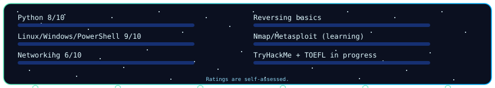
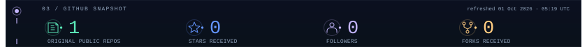
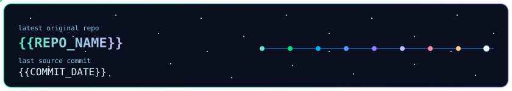

   
   
   
  

  

  
  
  
  
  
   
  
  

<!-- Crypto: replace BTC_ADDRESS_HERE, ETH_ADDRESS_HERE and USDT_ADDRESS_HERE
     in donations.svg, then specify the USDT network before enabling transfers.
     Live custom cards are generated by .github/workflows/snake.yml.
     github-live.svg and latest-repo.svg display immediately; the workflow refreshes them on main. -->

  
  
  

  
  

  

